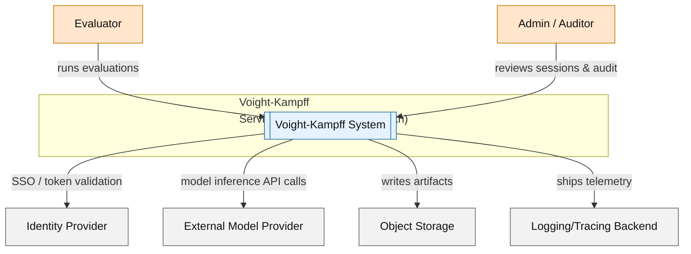

# C4-style Context Diagram — Voight-Kampff

**Type:** context

```mermaid
flowchart TB
  evaluator["Evaluator"]
  admin["Admin / Auditor"]

  subgraph sys["Voight-Kampff\nService-Based (Modular Monolith)"]
    systemNode[["Voight-Kampff System"]]
  end

  idp["Identity Provider"]
  provider["External Model Provider"]
  obj["Object Storage"]
  log["Logging/Tracing Backend"]

  evaluator -->|"runs evaluations"| systemNode
  admin -->|"reviews sessions & audit"| systemNode

  systemNode -->|"SSO / token validation"| idp
  systemNode -->|"model inference API calls"| provider
  systemNode -->|"writes artifacts"| obj
  systemNode -->|"ships telemetry"| log

  classDef person fill:#FFE6CC,stroke:#C77700,color:#111;
  classDef sysc fill:#E6F2FF,stroke:#1B6CA8,color:#111;
  classDef ext fill:#F2F2F2,stroke:#666,color:#111;

  class evaluator,admin person;
  class systemNode sysc;
  class idp,provider,obj,log ext;
```
