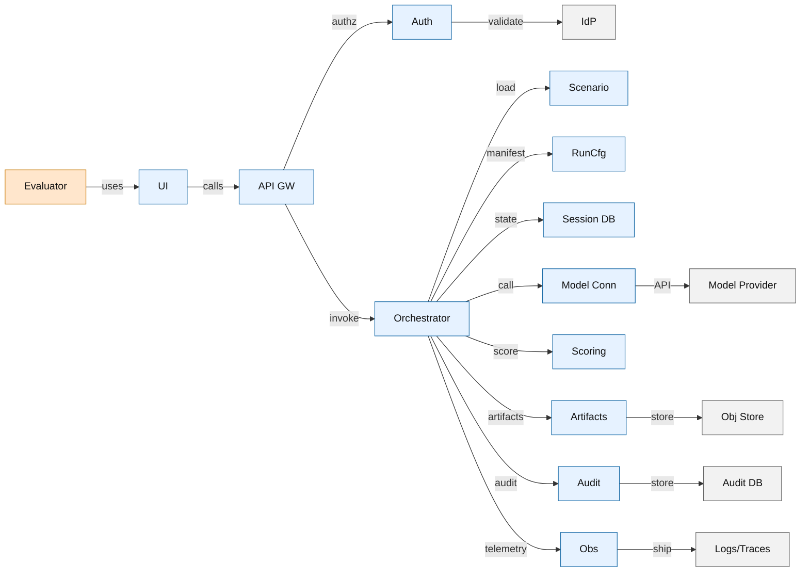

# Flowchart — Component Interaction (Critical Path)

**Type:** flowchart

```mermaid
flowchart LR
  eval["Evaluator"] -->|"uses"| ui["UI"]
  ui -->|"calls"| apigw["API GW"]
  apigw -->|"authz"| auth["Auth"]
  auth -->|"validate"| idp["IdP"]

  apigw -->|"invoke"| orch["Orchestrator"]
  orch -->|"load"| scen["Scenario"]
  orch -->|"manifest"| run["RunCfg"]
  orch -->|"state"| sess["Session DB"]
  orch -->|"call"| model["Model Conn"]
  model -->|"API"| prov["Model Provider"]
  orch -->|"score"| score["Scoring"]
  orch -->|"artifacts"| art["Artifacts"]
  orch -->|"audit"| audit["Audit"]
  orch -->|"telemetry"| obs["Obs"]

  art -->|"store"| obj["Obj Store"]
  audit -->|"store"| auditDb["Audit DB"]
  obs -->|"ship"| log["Logs/Traces"]

  classDef person fill:#FFE6CC,stroke:#C77700,color:#111;
  classDef sys fill:#E6F2FF,stroke:#1B6CA8,color:#111;
  classDef ext fill:#F2F2F2,stroke:#666,color:#111;

  class eval person;
  class ui,apigw,auth,orch,scen,run,sess,model,score,art,audit,obs sys;
  class idp,prov,obj,auditDb,log ext;
```
