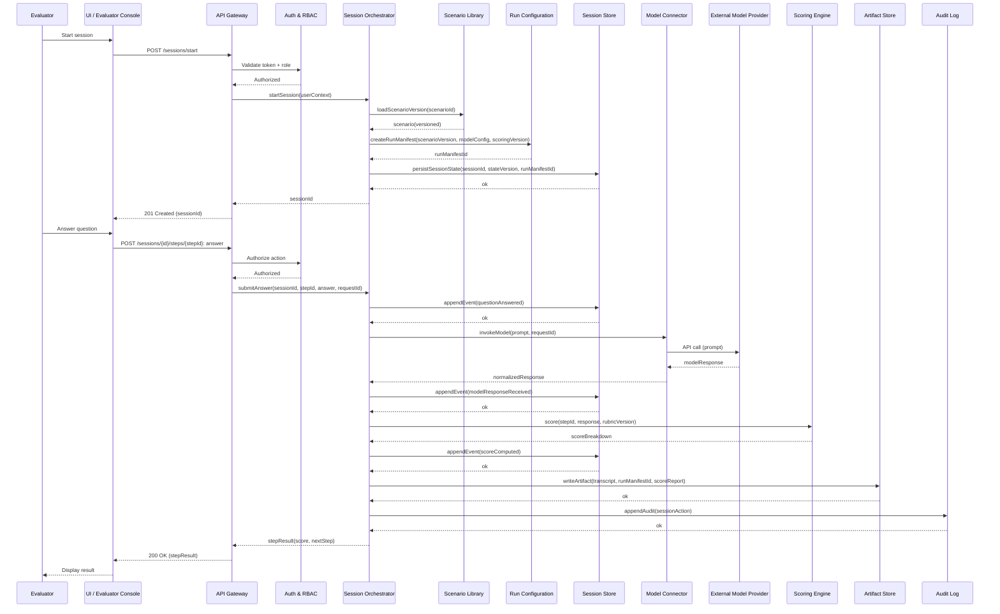

# Sequence Diagram — Interactive Evaluation Session (Happy Path)

**Type:** sequence

```mermaid
sequenceDiagram
  participant Evaluator as Evaluator
  participant UI as UI / Evaluator Console
  participant APIGW as API Gateway
  participant Auth as Auth & RBAC
  participant Orchestrator as Session Orchestrator
  participant Scenario as Scenario Library
  participant RunCfg as Run Configuration
  participant Store as Session Store
  participant Model as Model Connector
  participant Provider as External Model Provider
  participant Score as Scoring Engine
  participant Artifact as Artifact Store
  participant Audit as Audit Log

  Evaluator->>UI: Start session
  UI->>APIGW: POST /sessions/start
  APIGW->>Auth: Validate token + role
  Auth-->>APIGW: Authorized
  APIGW->>Orchestrator: startSession(userContext)
  Orchestrator->>Scenario: loadScenarioVersion(scenarioId)
  Scenario-->>Orchestrator: scenario(versioned)
  Orchestrator->>RunCfg: createRunManifest(scenarioVersion, modelConfig, scoringVersion)
  RunCfg-->>Orchestrator: runManifestId
  Orchestrator->>Store: persistSessionState(sessionId, stateVersion, runManifestId)
  Store-->>Orchestrator: ok
  Orchestrator-->>APIGW: sessionId
  APIGW-->>UI: 201 Created (sessionId)

  Evaluator->>UI: Answer question
  UI->>APIGW: POST /sessions/{id}/steps/{stepId}: answer
  APIGW->>Auth: Authorize action
  Auth-->>APIGW: Authorized
  APIGW->>Orchestrator: submitAnswer(sessionId, stepId, answer, requestId)
  Orchestrator->>Store: appendEvent(questionAnswered)
  Store-->>Orchestrator: ok
  Orchestrator->>Model: invokeModel(prompt, requestId)
  Model->>Provider: API call (prompt)
  Provider-->>Model: modelResponse
  Model-->>Orchestrator: normalizedResponse
  Orchestrator->>Store: appendEvent(modelResponseReceived)
  Store-->>Orchestrator: ok
  Orchestrator->>Score: score(stepId, response, rubricVersion)
  Score-->>Orchestrator: scoreBreakdown
  Orchestrator->>Store: appendEvent(scoreComputed)
  Store-->>Orchestrator: ok
  Orchestrator->>Artifact: writeArtifact(transcript, runManifestId, scoreReport)
  Artifact-->>Orchestrator: ok
  Orchestrator->>Audit: appendAudit(sessionAction)
  Audit-->>Orchestrator: ok
  Orchestrator-->>APIGW: stepResult(score, nextStep)
  APIGW-->>UI: 200 OK (stepResult)
  UI-->>Evaluator: Display result
```
